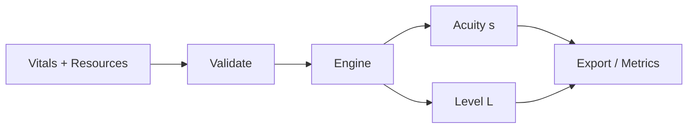
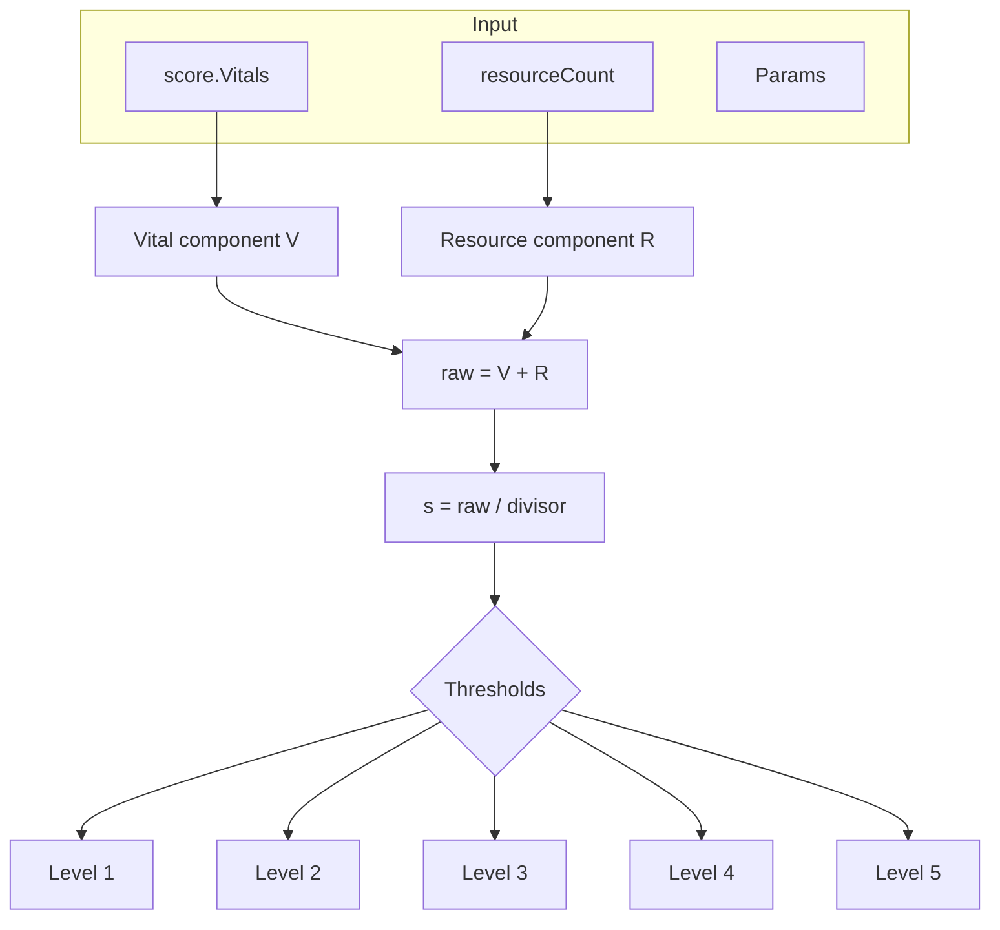
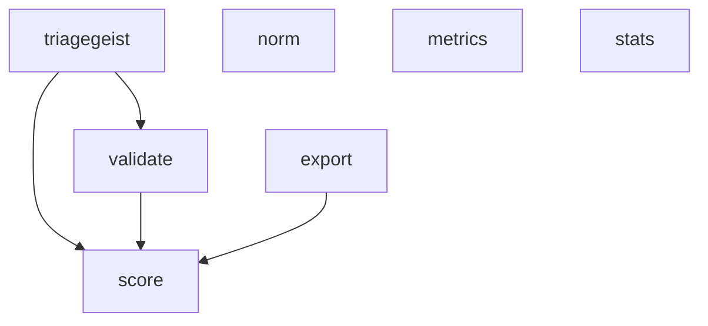
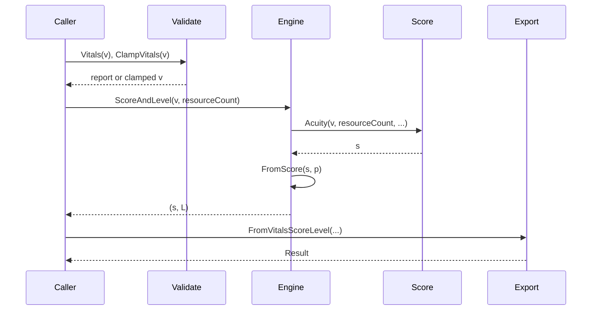
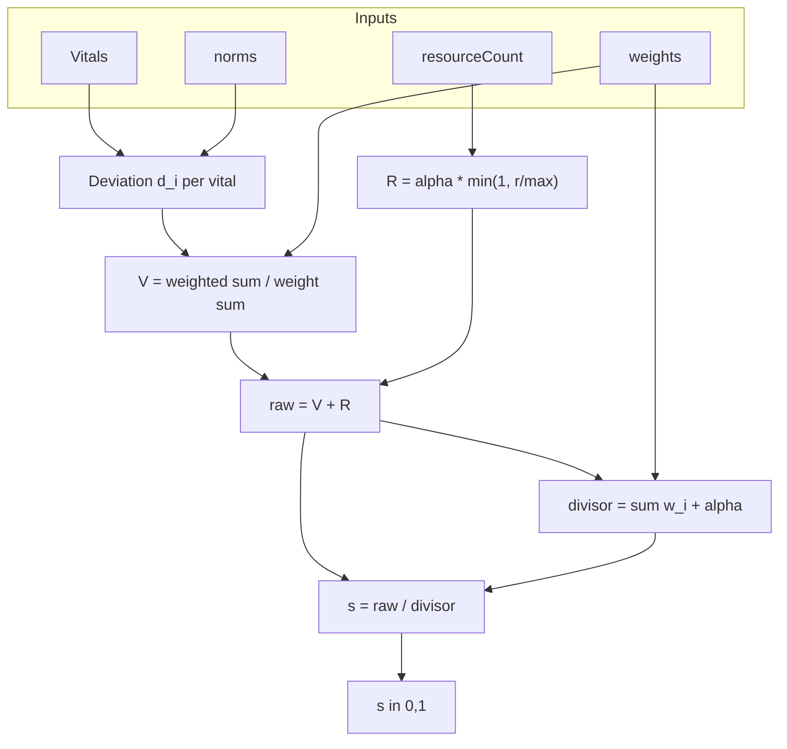
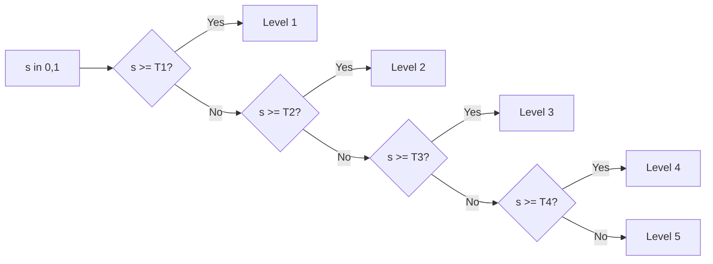

# triagegeist

<div align="center">

[](https://pkg.go.dev/github.com/olaflaitinen/triagegeist)
[](https://goreportcard.com/report/github.com/olaflaitinen/triagegeist)
[](https://go.dev/)
[](https://joinup.ec.europa.eu/collection/eupl/eupl-text-eupl-12)

[](https://github.com/olaflaitinen/triagegeist/releases)
[](https://github.com/olaflaitinen/triagegeist/commits/main)
[](https://github.com/olaflaitinen/triagegeist)
[](https://github.com/olaflaitinen/triagegeist)
[](https://github.com/olaflaitinen/triagegeist)
[](https://github.com/olaflaitinen/triagegeist/graphs/contributors)
[](https://github.com/olaflaitinen/triagegeist/issues)
[](https://github.com/olaflaitinen/triagegeist/network/members)
[](https://github.com/olaflaitinen/triagegeist/stargazers)
[](https://github.com/olaflaitinen/triagegeist/graphs/commit-activity)
[](https://pkg.go.dev/github.com/olaflaitinen/triagegeist)
[](https://github.com/olaflaitinen/triagegeist/blob/main/CONTRIBUTING.md)
[](LICENSE)


**High-performance parametric AI toolkit for emergency medicine triage and acuity scoring in Go.**

Deterministic · Zero-copy hot path · LaTeX-documented · EUPL-1.2

[Install](#installation) · [Usage](#usage) · [Formulas](#mathematical-model) · [Docs](https://pkg.go.dev/github.com/olaflaitinen/triagegeist) · [Contributing](CONTRIBUTING.md)

</div>

---

## Badge reference

| Badge | Meaning |
|-------|---------|
| Go Reference | Package documentation on pkg.go.dev |
| Go Report Card | Code quality and lint report |
| CI Status | GitHub Actions workflow status |
| Go Version | Minimum Go version (1.22) from go.mod |

| License EUPL-1.2 | European Union Public Licence v. 1.2 |
| GitHub release | Latest release tag |
| Last commit | Most recent commit on default branch |
| Repo size | Total repository size |
| Language count | Number of languages in repo |
| Code size | Lines/bytes of code |
| Contributors | Number of contributors |
| Issues / Forks / Stars | GitHub engagement |
| Maintained | Project maintenance status |
| Documentation | Link to pkg.go.dev |
| PRs Welcome | Contributions welcome |

---

## Table of contents

1. [Overview](#overview)
2. [Features](#features)
3. [Mathematical model](#mathematical-model)
4. [Symbol and formula reference](#symbol-and-formula-reference)
5. [Installation](#installation)
6. [Usage](#usage)
7. [API summary](#api-summary)
8. [Package layout](#package-layout)
9. [Architecture and data flow](#architecture-and-data-flow)
10. [Parameters and thresholds](#parameters-and-thresholds)
11. [Levels and wait times](#levels-and-wait-times)
12. [Metrics and accuracy](#metrics-and-accuracy)
13. [Validation and export](#validation-and-export)
14. [Examples](#examples)
15. [Benchmarks](#benchmarks)
16. [Comparison](#comparison)
17. [Documentation index](#documentation-index)
18. [Contributing and governance](#contributing-and-governance)
19. [License and authors](#license-and-authors)
20. [Disclaimer](#disclaimer)
21. [Quick reference (full API)](#quick-reference-full-api)
22. [Vital index reference](#vital-index-reference)
23. [Use case matrix](#use-case-matrix)
24. [Design rationale](#design-rationale)
25. [Evaluation pipeline (detailed)](#evaluation-pipeline-detailed)
26. [Score computation (flow)](#score-computation-flow)
27. [Level assignment (flow)](#level-assignment-flow)
28. [Statistics and metrics (overview)](#statistics-and-metrics-overview)
29. [FAQ](#faq)
30. [Version history (summary)](#version-history-summary)
31. [File manifest (key files)](#file-manifest-key-files)
32. [Notation and conventions](#notation-and-conventions)
33. [Extended formula derivations](#extended-formula-derivations)
34. [Benchmark interpretation](#benchmark-interpretation)
35. [Appendix: formula cheat sheet](#appendix-formula-cheat-sheet)

---

## Overview

triagegeist computes a **normalised acuity score** $s \in [0,1]$ and a **discrete triage level** $L \in \{1,2,3,4,5\}$ from vital signs and expected resource consumption. The implementation is fully parametric and deterministic: no external model files or heavy ML runtimes are required. The design prioritises speed, low memory use, and suitability for embedded or server-side deployment while remaining aligned with established emergency triage concepts.

| Attribute | Value |
|-----------|-------|
| **Authors** | Gustav Olaf Yunus Laitinen-Fredriksson Lundström-Imanov |
| **License** | European Union Public Licence v. 1.2 (EUPL-1.2) |
| **Repository** | [github.com/olaflaitinen/triagegeist](https://github.com/olaflaitinen/triagegeist) |
| **Documentation** | [pkg.go.dev/github.com/olaflaitinen/triagegeist](https://pkg.go.dev/github.com/olaflaitinen/triagegeist) |
| **Go version** | 1.22+ |
| **Logo** | SVG, transparent, 8000×2000 px in [assets/](assets/). See [assets/README.md](assets/README.md). |

---

## Features

| Category | Feature | Description |
|----------|---------|-------------|
| **Core** | Parametric acuity | Formula-based score $s \in [0,1]$ from vitals and resource count |
| **Core** | Five-level triage | Discrete level $L \in \{1,\ldots,5\}$ via configurable thresholds $T_1,\ldots,T_4$ |
| **Core** | Batch evaluation | `BatchScoreAndLevel`, `BatchAcuity`, `BatchLevel`, `BatchEvaluate` |
| **Core** | Presets | `DefaultParams`, `PresetStrict`, `PresetLenient`, `PresetResearch` |
| **Performance** | Pure Go | No cgo; portable and cross-compilable |
| **Performance** | Zero allocs (hot path) | Stack-allocated structs; no heap in single evaluation |
| **Performance** | Sub-microsecond latency | Target $t_{\mathrm{op}} \in [100,\,1000]$ ns per evaluation |
| **Correctness** | Deterministic | Same inputs and params always yield same $s$ and $L$ |
| **Correctness** | Validated params | `Params.Validate()`, `ValidateParamsExternal` |
| **Correctness** | Input validation | `validate.Vitals`, `validate.ClampVitals`, `validate.ResourceCount` |
| **Metrics** | Confusion matrix | $5 \times 5$ counts; TP, FP, FN, TN per class |
| **Metrics** | Sensitivity, specificity | Per level or binary; PPV, NPV, F1 |
| **Metrics** | Cohen's $\kappa$, weighted $\kappa$ | Agreement vs chance; adjacent-level agreement |
| **Metrics** | AUC, calibration error | From scores and binary outcomes |
| **Statistics** | Descriptive | Mean $\bar{x}$, $\sigma$, $\mathrm{CI}_{95}$, median, percentiles |
| **Statistics** | Level distribution | Counts and proportions per level |
| **Export** | JSON, CSV | Single result or batch; level report, summary |
| **Documentation** | LaTeX | All formulas in $ \ldots $ and $$ \ldots $$ |
| **Documentation** | Tables and schemas | README, docs, and package doc with Mermaid where applicable |

---

## Mathematical model

### Acuity score

The raw acuity aggregate is a weighted combination of vital-sign deviation and resource count, then normalised to the unit interval.

#### Vital component

For each vital $i$ with observed value $x_i$, reference midpoint $\mu_i$, and half-width $\sigma_i$:

$$
d_i = \min\left(1,\; \frac{|x_i - \mu_i|}{\sigma_i}\right)
$$

Only **present** vitals (e.g. $x_i \neq 0$ where 0 denotes missing) are included. The vital component $V$ is:

$$
V = \frac{\sum_{i \in \mathcal{I}} w_i \, d_i}{\sum_{i \in \mathcal{I}} w_i}
$$

where $\mathcal{I}$ is the set of indices with present values and $w_i \geq 0$ are configurable weights.

#### Resource component

$$
R = \alpha \cdot \min\left(1,\; \frac{\texttt{resourceCount}}{\texttt{maxResources}}\right)
$$

with $\alpha = \text{resourceWeight}$ and $\texttt{maxResources}$ the cap on expected resources.

#### Normalised score

$$
\text{raw} = V + R,\qquad
s = \frac{\text{raw}}{\sum_i w_i + \alpha},\qquad
s \in [0,1]
$$

Implementations clamp $s$ to $[0,1]$ when necessary.

---

## Symbol and formula reference

| Symbol | Meaning | Typical range / unit |
|--------|---------|----------------------|
| $s$ | Normalised acuity score | $[0,1]$ |
| $L$ | Discrete triage level | $\{1,2,3,4,5\}$ |
| $x_i$ | Observed value of vital $i$ | Vital-specific (bpm, /min, mmHg, °C, %, 3–15) |
| $\mu_i$ | Reference midpoint for vital $i$ | Vital-specific |
| $\sigma_i$ | Half-width for vital $i$ | Vital-specific |
| $d_i$ | Deviation $\min(1, |x_i-\mu_i|/\sigma_i)$ | $[0,1]$ |
| $w_i$ | Weight for vital $i$ | $[0,1]$ |
| $\alpha$ | Resource weight | $\alpha \geq 0$ |
| $V$ | Vital component | $[0,1]$ |
| $R$ | Resource component | $[0,1]$ |
| $T_1, T_2, T_3, T_4$ | Score thresholds for level assignment | $0 < T_4 < T_3 < T_2 < T_1 \leq 1$ |
| $\mathcal{I}$ | Set of indices with present vitals | Subset of $\{0,\ldots,6\}$ |

| Formula | Expression |
|---------|------------|
| Deviation | $d_i = \min(1, \lvert x_i - \mu_i \rvert / \sigma_i)$ |
| Vital component | $V = \bigl(\sum_{i \in \mathcal{I}} w_i d_i\bigr) / \bigl(\sum_{i \in \mathcal{I}} w_i\bigr)$ |
| Resource component | $R = \alpha \cdot \min(1, \texttt{resourceCount}/\texttt{maxResources})$ |
| Raw score | $\text{raw} = V + R$ |
| Normalised score | $s = \text{raw} / (\sum_i w_i + \alpha)$ |
| Level 1 | $s \geq T_1$ |
| Level 2 | $T_2 \leq s < T_1$ |
| Level 3 | $T_3 \leq s < T_2$ |
| Level 4 | $T_4 \leq s < T_3$ |
| Level 5 | $s < T_4$ |

---

## Installation

Requires **Go 1.22 or later**.

```bash
go get github.com/olaflaitinen/triagegeist
```

| Requirement | Version / note |
|-------------|----------------|
| Go | 1.22+ |
| Dependencies | None for core and score; norm, metrics, stats, validate, export are part of the module |
| Platforms | All supported by Go (linux, windows, darwin, etc.) |

---

## Usage

### Basic: default parameters

```go
package main

import (
	"fmt"
	"github.com/olaflaitinen/triagegeist"
	"github.com/olaflaitinen/triagegeist/score"
)

func main() {
	p := triagegeist.DefaultParams()
	eng := triagegeist.NewEngine(p)

	v := score.Vitals{HR: 120, RR: 24, SBP: 90, SpO2: 92}
	resourceCount := 3

	acuity, level := eng.ScoreAndLevel(v, resourceCount)
	fmt.Printf("acuity: %.3f, level: %d (%s)\n", acuity, level, level.String())
}
```

### Custom parameters

```go
	p := triagegeist.DefaultParams()
	p.T1, p.T2 = 0.90, 0.65
	if !p.Validate() { return }
	eng := triagegeist.NewEngine(p)
```

### Batch evaluation

```go
	acuities, levels := eng.BatchScoreAndLevel(vitals, resourceCounts)
```

### Validation and export

```go
	report := validate.Vitals(v)
	if !report.Valid { v = validate.ClampVitals(v) }
	res := export.FromVitalsScoreLevel(v, resourceCount, acuity, level.Int(), level.String())
```

---

## API summary

| API | Package | Description |
|-----|---------|-------------|
| `DefaultParams`, `PresetStrict`, `PresetLenient`, `PresetResearch` | triagegeist | Parameter presets |
| `Params.Validate`, `ValidateParamsExternal` | triagegeist, validate | Parameter validation |
| `NewEngine(p)`, `eng.Acuity`, `eng.Level`, `eng.ScoreAndLevel` | triagegeist | Single evaluation |
| `eng.BatchScoreAndLevel`, `eng.BatchAcuity`, `eng.BatchLevel`, `eng.BatchEvaluate` | triagegeist | Batch evaluation |
| `FromScore(s, p)` | triagegeist | Map $s$ to $L$ |
| `Level.String`, `Level.WaitTimeMinutes`, `Level.IsHighAcuity` | triagegeist | Level helpers |
| `score.Vitals`, `score.Acuity`, `score.VitalComponent`, `score.ResourceComponent` | score | Formula and vitals |
| `norm.DefaultRanges`, `norm.Deviation`, `norm.Ranges` | norm | Reference ranges |
| `metrics.NewConfusionMatrix`, `cm.Sensitivity`, `cm.CohenKappa`, `metrics.AUC` | metrics | Accuracy metrics |
| `stats.Mean`, `stats.CI95`, `stats.ComputeScoreStats`, `stats.ComputeLevelStats` | stats | Statistics |
| `validate.Vitals`, `validate.ClampVitals`, `validate.ResourceCount` | validate | Input validation |
| `export.FromVitalsScoreLevel`, `export.WriteCSV`, `export.LevelReport` | export | Export and reports |

---

## Package layout

```
triagegeist/
├── .github/
│   ├── ISSUE_TEMPLATE/
│   └── PULL_REQUEST_TEMPLATE.md
├── assets/
│   └── README.md
├── docs/
│   ├── README.md
│   ├── ARCHITECTURE.md
│   ├── BENCHMARKS.md
│   └── COMPARISON.md
├── examples/
│   ├── README.md
│   ├── basic/
│   └── advanced/
├── norm/
├── score/
├── metrics/
├── stats/
├── validate/
├── export/
├── doc.go, params.go, level.go, engine.go, params_validate.go
├── *_test.go
├── go.mod, LICENSE, NOTICE, CHANGELOG.md
├── CONTRIBUTING.md, SECURITY.md, CODE_OF_CONDUCT.md, GOVERNANCE.md
└── README.md
```

| Package | Path | Responsibility |
|---------|------|----------------|
| triagegeist | Root | Engine, Params, Level, FromScore, batch, presets |
| score | score/ | Vitals, acuity formula, vital/resource components |
| norm | norm/ | Reference ranges, Deviation, normalisation |
| metrics | metrics/ | Confusion matrix, sensitivity, specificity, \( \kappa \), AUC |
| stats | stats/ | Mean, CI, percentiles, level distribution, RMSE, MAE |
| validate | validate/ | Vitals and params validation, clamping |
| export | export/ | Result, JSON/CSV, level report, summary |

---

## Architecture and data flow

### High-level pipeline



### Data flow (step-by-step)



### Package dependencies



---

## Parameters and thresholds

### Default parameters

| Symbol / name | Meaning | Default value |
|---------------|---------|---------------|
| $w_{\mathrm{HR}}$ | Heart rate weight | 0.18 |
| $w_{\mathrm{RR}}$ | Respiratory rate weight | 0.22 |
| $w_{\mathrm{SBP}}$ | Systolic BP weight | 0.16 |
| $w_{\mathrm{DBP}}$ | Diastolic BP weight | 0.10 |
| $w_{\mathrm{Temp}}$ | Temperature weight | 0.08 |
| $w_{\mathrm{SpO2}}$ | Oxygen saturation weight | 0.16 |
| $w_{\mathrm{GCS}}$ | Glasgow Coma Scale weight | 0.10 |
| $\alpha$ | Resource weight | 0.25 |
| maxResources | Cap on resource count | 6 |
| $T_1$ | Threshold level 1 | 0.85 |
| $T_2$ | Threshold level 2 | 0.60 |
| $T_3$ | Threshold level 3 | 0.35 |
| $T_4$ | Threshold level 4 | 0.15 |

### Reference ranges (mid $\mu$, half-width $\sigma$)

| Vital | $\mu$ | $\sigma$ | Unit |
|-------|-----------|--------------|------|
| HR | 80 | 40 | bpm |
| RR | 16 | 10 | /min |
| SBP | 120 | 40 | mmHg |
| DBP | 80 | 30 | mmHg |
| Temp | 37.0 | 2.0 | °C |
| SpO2 | 98 | 8 | % |
| GCS | 15 | 6 | 3–15 |

### Presets

| Preset | $T_1$ | $T_2$ | $T_3$ | $T_4$ | Use case |
|--------|-----------|-----------|-----------|-----------|----------|
| Default | 0.85 | 0.60 | 0.35 | 0.15 | General ED |
| Strict | 0.80 | 0.55 | 0.30 | 0.12 | Minimise under-triage |
| Lenient | 0.90 | 0.68 | 0.42 | 0.18 | Reduce over-triage |
| Research | 0.80 | 0.60 | 0.40 | 0.20 | Balanced cohorts |

---

## Levels and wait times

| Level $L$ | Label | Condition | Typical wait (guidance) |
|---------------|-------|-----------|--------------------------|
| 1 | Resuscitation | $s \geq T_1$ | Immediate |
| 2 | Emergent | $T_2 \leq s < T_1$ | &lt; 15 min |
| 3 | Urgent | $T_3 \leq s < T_2$ | &lt; 60 min |
| 4 | Less urgent | $T_4 \leq s < T_3$ | &lt; 120 min |
| 5 | Non-urgent | $s < T_4$ | &lt; 240 min |

| Level | Wait time (minutes) | High acuity? | Low acuity? |
|-------|---------------------|--------------|-------------|
| 1 | 0 | Yes | No |
| 2 | 15 | Yes | No |
| 3 | 60 | No | No |
| 4 | 120 | No | Yes |
| 5 | 240 | No | Yes |

---

## Metrics and accuracy

When reference (ground truth) levels are available, use the **metrics** package.

| Metric | Formula / definition |
|--------|----------------------|
| Sensitivity (per class) | $\mathrm{Sens} = \mathrm{TP}/(\mathrm{TP}+\mathrm{FN})$ |
| Specificity (per class) | $\mathrm{Spec} = \mathrm{TN}/(\mathrm{TN}+\mathrm{FP})$ |
| PPV | $\mathrm{PPV} = \mathrm{TP}/(\mathrm{TP}+\mathrm{FP})$ |
| NPV | $\mathrm{NPV} = \mathrm{TN}/(\mathrm{TN}+\mathrm{FN})$ |
| F1 | $\mathrm{F1} = 2\,\mathrm{PPV}\,\mathrm{Sens}/(\mathrm{PPV}+\mathrm{Sens})$ |
| Cohen's $\kappa$ | $\kappa = (p_o - p_e)/(1 - p_e)$ |
| Weighted kappa | Linear weights on level distance |
| AUC | Trapezoidal rule on ROC curve |
| Calibration error | Mean $\lvert \mathrm{score} - \mathrm{outcome} \rvert$ |

| Package | Use |
|---------|-----|
| metrics | ConfusionMatrix, Sensitivity, Specificity, PPV, NPV, F1, CohenKappa, BinaryCM, AUC, CalibrationError, WeightedKappa |
| stats | Mean $\bar{x}$, StdDev $\sigma$, $\mathrm{CI}_{95}$, median, percentiles, LevelDistribution, ComputeScoreStats, ExactAgreement, WithinLevel |

---

## Validation and export

| Function | Package | Description |
|----------|---------|-------------|
| `validate.Vitals(v)` | validate | Report per-vital status (ok / clamped / invalid / missing) |
| `validate.ClampVitals(v)` | validate | Return vitals clamped to valid ranges |
| `validate.ResourceCount(count, max)` | validate | Clamp count to \( [0, \texttt{max}] \) |
| `validate.Params(ParamsLike)` | validate | Validate weights and thresholds |
| `export.FromVitalsScoreLevel(...)` | export | Build Result for JSON/CSV |
| `export.WriteCSV(w, results)` | export | Write batch CSV |
| `export.LevelReport(results)` | export | Per-level counts and mean acuity |
| `export.ComputeSummary(results)` | export | \( N \), mean acuity, min, max, level distribution |

---

## Examples

| Example | Path | Description |
|---------|------|-------------|
| Basic | [examples/basic](examples/basic) | Single evaluation, validation, export struct |
| Advanced | [examples/advanced](examples/advanced) | Batch evaluation, metrics, stats, CSV output |

From repository root:

```bash
go run ./examples/basic
go run ./examples/advanced
```

See [examples/README.md](examples/README.md) for requirements and learning path.

---

## Benchmarks

| Benchmark | Package | Measures |
|-----------|---------|----------|
| BenchmarkEngine_ScoreAndLevel | triagegeist | Full path: vitals + resourceCount → acuity + level |
| BenchmarkEngine_Acuity | triagegeist | Acuity only |
| BenchmarkScore_Acuity | score | Direct Acuity call |

Run:

```bash
go test -bench=. -benchmem ./...
```

| Metric | Symbol | Target |
|--------|--------|--------|
| Latency | $t_{\mathrm{op}}$ | Hundreds of ns per evaluation |
| Allocations | $n_{\mathrm{alloc}}$ | 0 in hot path |
| Throughput | $10^9/t_{\mathrm{op}}$ | Millions of evals/s per core (theory) |

See [docs/BENCHMARKS.md](docs/BENCHMARKS.md) for full details.

---

## Comparison

| Dimension | triagegeist | Heavy ML (e.g. Python/TF) | Ad-hoc Go | Proprietary (ESI/MTS) |
|-----------|-------------|----------------------------|-----------|------------------------|
| Speed | Very high | Lower | Depends | N/A |
| Allocations | Zero (hot path) | Higher | Depends | N/A |
| Determinism | Full | Model-dependent | Depends | Yes (closed) |
| Configurability | Full (params) | Model-dependent | Depends | Limited |
| Licence | EUPL-1.2, open | Varies | Varies | Often restricted |
| Domain | ED triage/acuity | General ML | Varies | ED triage |

See [docs/COMPARISON.md](docs/COMPARISON.md) for full comparison.

---

## Documentation index

| Resource | Location |
|----------|----------|
| Package API | [pkg.go.dev/github.com/olaflaitinen/triagegeist](https://pkg.go.dev/github.com/olaflaitinen/triagegeist) |
| Architecture | [docs/ARCHITECTURE.md](docs/ARCHITECTURE.md) |
| Benchmarks | [docs/BENCHMARKS.md](docs/BENCHMARKS.md) |
| Comparison | [docs/COMPARISON.md](docs/COMPARISON.md) |
| Changelog | [CHANGELOG.md](CHANGELOG.md) |
| Contributing | [CONTRIBUTING.md](CONTRIBUTING.md) |
| Governance | [GOVERNANCE.md](GOVERNANCE.md) |
| Security | [SECURITY.md](SECURITY.md) |
| Code of conduct | [CODE_OF_CONDUCT.md](CODE_OF_CONDUCT.md) |

---

## Contributing and governance

Contributions are welcome under EUPL-1.2. Please read [CONTRIBUTING.md](CONTRIBUTING.md) for workflow, code style, and testing. By submitting contributions, you agree to license them under EUPL-1.2. Report security issues privately; see [SECURITY.md](SECURITY.md).

| Document | Purpose |
|----------|---------|
| CONTRIBUTING.md | Workflow, tests, benchmarks, PR process |
| GOVERNANCE.md | Maintainers, decision-making |
| CODE_OF_CONDUCT.md | Community standards |
| SECURITY.md | Vulnerability reporting |

---

## License and authors

| Item | Value |
|------|-------|
| License | European Union Public Licence v. 1.2 (EUPL-1.2) |
| Full text | [LICENSE](LICENSE) |
| Authors | Gustav Olaf Yunus Laitinen-Fredriksson Lundström-Imanov |

---

## Disclaimer

This library is for **research and decision support only**. It is not a substitute for clinical judgment or institutional triage protocols. Use in production clinical systems is at the user's risk. Operators must validate and calibrate parameters for their setting and regulatory context.

---

## Quick reference (full API)

| Task | Package or API |
|------|----------------|
| Single evaluation | `eng.ScoreAndLevel(v, resources)` |
| Batch evaluation | `eng.BatchScoreAndLevel(vitals, resources)` |
| Acuity only | `eng.Acuity(v, resources)` |
| Level only | `eng.Level(v, resources)` |
| Custom thresholds | `p.T1, p.T2, p.T3, p.T4` then `NewEngine(p)` |
| Validate vitals | `validate.Vitals(v)`, `validate.ClampVitals(v)` |
| Validate params | `p.Validate()` or `ValidateParamsExternal(p)` |
| Resource clamp | `validate.ResourceCount(count, maxResources)` |
| Metrics (confusion) | `metrics.NewConfusionMatrix(pred, ref)`, `cm.Sensitivity(1)`, `cm.CohenKappa()` |
| Metrics (binary) | `metrics.NewBinaryCM(pred, ref, []int{1,2})` |
| Statistics | `stats.Mean(scores)`, `stats.CI95(scores)`, `stats.ComputeLevelStats(levels)` |
| Export | `export.FromVitalsScoreLevel(...)`, `export.WriteCSV(w, results)` |
| Level report | `export.LevelReport(results)` |
| Summary | `export.ComputeSummary(results)` |

---

## Vital index reference

| Index $i$ | Vital | Field (score.Vitals) | Unit | Default $\mu_i$ | Default $\sigma_i$ |
|---------------|--------|----------------------|------|---------------------|------------------------|
| 0 | HR | HR | bpm | 80 | 40 |
| 1 | RR | RR | /min | 16 | 10 |
| 2 | SBP | SBP | mmHg | 120 | 40 |
| 3 | DBP | DBP | mmHg | 80 | 30 |
| 4 | Temp | Temp | °C | 37.0 | 2.0 |
| 5 | SpO2 | SpO2 | % | 98 | 8 |
| 6 | GCS | GCS | 3–15 | 15 | 6 |

Missing vitals: use 0 for integer fields or 0.0 for Temp; they are excluded from $\mathcal{I}$.

---

## Use case matrix

| Use case | Engine | Params | Validate | Metrics | Stats | Export |
|----------|--------|--------|----------|---------|-------|--------|
| Single ED triage | Yes | Default or custom | Optional | No | No | Optional |
| Batch audit | Batch methods | Default or custom | Yes | Optional | Yes | Yes |
| Research / calibration | Yes | PresetResearch or custom | Yes | Yes (with ref) | Yes | Yes |
| Education / demo | Yes | DefaultParams | Yes | Yes | Yes | Yes |
| Integration (API) | Yes | Custom | Yes | No | Optional | Yes (JSON/CSV) |

---

## Design rationale

| Decision | Rationale |
|----------|-----------|
| Pure Go, no cgo | Portability, cross-compilation, no C toolchain. |
| No default external deps | Small footprint; versioning and supply-chain simplicity. |
| Parametric formula only | Reproducibility, auditability, low latency. ML can be wrapped if needed. |
| Vitals as struct | Predictable layout, no heap in hot path, strong typing. |
| Separate score package | Formula testable without full API; clear separation of concerns. |
| norm package | Reusable ranges and deviation; usable outside score. |
| metrics and stats | Callers choose accuracy vs descriptive stats; no forced dependency. |
| validate package | Explicit validation and clamping; root package stays thin. |
| export package | Centralised JSON/CSV and reporting. |
| LaTeX in docs | Formulas render on GitHub and in MathJax/KaTeX viewers. |

---

## Evaluation pipeline (detailed)



---

## Score computation (flow)



---

## Level assignment (flow)



---

## Statistics and metrics (overview)

| Domain | Package | Main types / functions |
|--------|---------|-------------------------|
| Descriptive | stats | Mean, Variance, StdDev, SE, CI95, Median, Percentile, Min, Max |
| Sample stats | stats | ComputeScoreStats, ComputeLevelStats, LevelDistribution |
| Agreement | stats | ExactAgreement, WithinLevel |
| Error | stats | RMSE, MAE, WithinTolerance |
| Correlation | stats | CorrelationPearson |
| Confusion | metrics | ConfusionMatrix, NewConfusionMatrix, TP, FP, FN, TN |
| Per-class | metrics | Sensitivity, Specificity, PPV, NPV, F1, Accuracy |
| Aggregate | metrics | OverallAccuracy, MacroSensitivity, MacroSpecificity |
| Agreement | metrics | CohenKappa, WeightedKappa |
| Binary | metrics | BinaryCM, NewBinaryCM |
| Curves | metrics | AUC, CalibrationError |

---

## FAQ

| Question | Answer |
|----------|--------|
| Does triagegeist implement ESI or MTS? | No. It provides a parametric, auditable alternative. Use official ESI/MTS if you need certified algorithms. |
| Can I use custom reference ranges? | Yes. Use `score.VitalComponentWithNorms` and `score.AcuityWithNorms` with a `[7][2]float64` norms array, or `norm.Ranges` and build your own aggregation. |
| Are there allocations in the hot path? | The design aims for zero when Vitals and Params are stack-allocated and not escaped. |
| How do I report a security issue? | Do not use public issues. See [SECURITY.md](SECURITY.md) for private reporting. |
| What Go version is required? | Go 1.22 or later (see go.mod). |
| Is the library thread-safe? | Yes. Engine is safe for concurrent use; Params is not mutated during evaluation. |
| How do I cite triagegeist? | Cite the repository and licence (EUPL-1.2); list authors as in this README. |

---

## Version history (summary)

| Version | Focus |
|---------|--------|
| 1.0.0 | Initial release: Engine, Params, Level, score, norm, metrics, stats, validate, export, docs, examples. |
| Unreleased | See [CHANGELOG.md](CHANGELOG.md) for ongoing changes. |

---

## File manifest (key files)

| File | Purpose |
|------|---------|
| doc.go | Package documentation and formula/table summary |
| params.go | Params struct, DefaultParams, PresetStrict/Lenient/Research, Validate, Clone, thresholds |
| params_validate.go | ValidateParamsExternal (bridge to validate package) |
| level.go | Level type, FromScore, String, WaitTimeMinutes, IsHighAcuity, ParseLevel, LevelCounts, etc. |
| engine.go | Engine, NewEngine, Acuity, Level, ScoreAndLevel, Batch*, Evaluate, Filter*, AcuityStats |
| score/score.go | Vitals, VitalComponent, ResourceComponent, Acuity, AcuityWithNorms, default norms/weights |
| norm/norm.go | Ranges, DefaultRanges, PediatricRanges, Deviation, NormalizeLinear, CriticalBounds, WeightedDeviationSum |
| metrics/metrics.go | ConfusionMatrix, BinaryCM, Sensitivity, Specificity, PPV, NPV, F1, CohenKappa, AUC, CalibrationError, WeightedKappa |
| stats/stats.go | Mean, Variance, StdDev, CI95, Median, Percentile, ComputeScoreStats, ComputeLevelStats, RMSE, MAE, ExactAgreement |
| validate/validate.go | Vitals, ClampVitals, ResourceCount, ParamsLike, Params, AtLeastOneVital |
| export/export.go | Result, FromVitalsScoreLevel, ToJSON, WriteCSV, LevelReport, ComputeSummary, ResultToVitals |

---

## Appendix: formula cheat sheet

### Acuity

$$
d_i = \min\left(1,\ \frac{|x_i - \mu_i|}{\sigma_i}\right),\qquad
V = \frac{\sum_{i \in \mathcal{I}} w_i d_i}{\sum_{i \in \mathcal{I}} w_i},\qquad
R = \alpha \cdot \min\left(1,\ \frac{\texttt{resourceCount}}{\texttt{maxResources}}\right)
$$

$$
\text{raw} = V + R,\qquad
s = \frac{\text{raw}}{\sum_i w_i + \alpha},\qquad
s \in [0,1]
$$

### Level assignment

| Condition | Level |
|-----------|-------|
| $s \geq T_1$ | 1 (Resuscitation) |
| $T_2 \leq s < T_1$ | 2 (Emergent) |
| $T_3 \leq s < T_2$ | 3 (Urgent) |
| $T_4 \leq s < T_3$ | 4 (Less urgent) |
| $s < T_4$ | 5 (Non-urgent) |

### Metrics (binary)

$$
\mathrm{Sens} = \frac{\mathrm{TP}}{\mathrm{TP}+\mathrm{FN}},\qquad
\mathrm{Spec} = \frac{\mathrm{TN}}{\mathrm{TN}+\mathrm{FP}},\qquad
\mathrm{PPV} = \frac{\mathrm{TP}}{\mathrm{TP}+\mathrm{FP}},\qquad
\mathrm{NPV} = \frac{\mathrm{TN}}{\mathrm{TN}+\mathrm{FN}}
$$

$$
\mathrm{F1} = \frac{2\,\mathrm{PPV}\,\mathrm{Sens}}{\mathrm{PPV}+\mathrm{Sens}},\qquad
\kappa = \frac{p_o - p_e}{1 - p_e}
$$

### LaTeX in documentation

All Markdown documentation uses LaTeX for mathematics:

- **Inline:** $ \ldots $ e.g. $s \in [0,1]$, $\alpha$, $T_1$.
- **Display:** $$ \ldots $$ for block equations.

The same convention is used in [docs/](docs/), [CONTRIBUTING.md](CONTRIBUTING.md), and package doc comments.

---

## Notation and conventions

| Convention | Meaning |
|------------|---------|
| $\mathcal{I}$ | Set of vital indices with present (non-missing) values |
| $\mathbb{R}_{\geq 0}$ | Non-negative reals |
| $[a,b]$ | Closed interval; $s \in [0,1]$ |
| $\{1,\ldots,5\}$ | Discrete level set |
| $\bar{x}$ | Sample mean |
| $\sigma$, $\sigma^2$ | Standard deviation, variance |
| $\mathrm{CI}_{95}$ | 95% confidence interval |
| $\kappa$ | Cohen's kappa (agreement) |
| TP, FP, FN, TN | True/False Positive/Negative counts |
| PPV, NPV | Positive/Negative predictive value |
| bpm | Beats per minute (HR) |
| /min | Per minute (RR) |
| mmHg | Millimetres of mercury (SBP, DBP) |
| °C | Degrees Celsius (Temp) |
| % | Percentage (SpO2) |
| GCS | Glasgow Coma Scale (3–15) |

All angles in formulas are in radians where applicable. Weights $w_i$ and $\alpha$ are non-negative; missing vitals are excluded from sums.

---

## Extended formula derivations

### Why $d_i = \min(1, |x_i - \mu_i|/\sigma_i)$

Deviation is capped at 1 so that a single extreme vital does not dominate: $d_i \in [0,1]$. The ratio $|x_i - \mu_i|/\sigma_i$ is a normalised distance; $\sigma_i$ acts as a scale (half-width). Beyond one “sigma” from $\mu_i$, we treat the vital as maximally deviant (1).

### Why $s = \text{raw} / (\sum_i w_i + \alpha)$

The denominator equals the maximum possible raw value when every $d_i = 1$ and resources are at cap: $V_{\max} = \sum_i w_i$, $R_{\max} = \alpha$, so $\text{raw}_{\max} = \sum_i w_i + \alpha$. Dividing by this keeps $s \in [0,1]$.

### Level thresholds

$T_1 > T_2 > T_3 > T_4$. Higher score $s$ means higher acuity; so $s \geq T_1$ gives the most urgent level (1). Defaults (e.g. 0.85, 0.65, 0.45, 0.25) are tunable per site.

### Cohen's kappa

$p_o$ = observed proportion of agreement, $p_e$ = expected agreement by chance. $\kappa = (p_o - p_e)/(1 - p_e) \in [-1,1]$; 0 = chance, 1 = perfect agreement.

---

## Benchmark interpretation

| Metric | Interpretation |
|--------|----------------|
| ns/op | Nanoseconds per operation (lower is better) |
| B/op | Bytes allocated per operation (0 = no heap in hot path) |
| allocs/op | Number of allocations per operation (0 = no allocs) |
| Single evaluation | One call to ScoreAndLevel; target sub-µs |
| Batch N | N evaluations in one call; amortised cost per item |
| Comparison | Compare ns/op across libraries; same hardware and Go version |

Run with `go test -bench=. -benchmem ./...` and ensure no regressions after changes. See [docs/BENCHMARKS.md](docs/BENCHMARKS.md) for full methodology.

---

## Code snippets (usage patterns)

### Minimal single evaluation

```go
import (
    "fmt"
    "github.com/olaflaitinen/triagegeist"
    "github.com/olaflaitinen/triagegeist/score"
)
eng := triagegeist.NewEngine(triagegeist.DefaultParams())
v := score.Vitals{HR: 120, RR: 20, SBP: 90, GCS: 15}
s, L := eng.ScoreAndLevel(v, 3)
fmt.Printf("score=%.3f level=%s\n", s, L.String())
```

### Batch with validation and export

```go
import (
    "github.com/olaflaitinen/triagegeist"
    "github.com/olaflaitinen/triagegeist/export"
    "github.com/olaflaitinen/triagegeist/validate"
)
eng := triagegeist.NewEngine(triagegeist.DefaultParams())
var results []export.Result
for i := range vitals {
    if validate.VitalsValid(vitals[i]) {
        s, L := eng.ScoreAndLevel(vitals[i], resources[i])
        results = append(results, export.FromVitalsScoreLevel(vitals[i], resources[i], s, L.Int(), L.String()))
    }
}
export.WriteCSV(os.Stdout, results)
```

### Custom thresholds (stricter level 1)

```go
p := triagegeist.DefaultParams()
p.T1, p.T2, p.T3, p.T4 = 0.90, 0.70, 0.50, 0.30
if err := p.Validate(); err != nil { /* handle */ }
eng := triagegeist.NewEngine(p)
```

### Metrics vs reference levels

```go
import "github.com/olaflaitinen/triagegeist/metrics"
pred := []int{1,2,2,3,4,5}  // predicted levels
ref  := []int{1,2,3,3,4,5}  // reference (e.g. nurse)
cm, _ := metrics.NewConfusionMatrix(pred, ref)
fmt.Printf("kappa=%.3f\n", cm.CohenKappa())
```

### Level distribution from batch

```go
import "github.com/olaflaitinen/triagegeist/stats"
levelInts := make([]int, len(results))
for i := range results { levelInts[i] = results[i].Level }
dist := stats.LevelDistribution(levelInts)
for L := 1; L <= 5; L++ { fmt.Printf("L%d: %d\n", L, dist[L]) }
```

---

## Glossary

| Term | Definition |
|------|------------|
| Acuity | Severity of condition; higher acuity = more urgent. |
| Triage | Prioritisation of patients by urgency. |
| Level | Discrete triage level $1$–$5$ ($1$ = most urgent). |
| Score | Continuous normalised value $s \in [0,1]$. |
| Vital signs | HR, RR, SBP, DBP, Temp, SpO2, GCS. |
| Resource count | Number of expected resources (beds, procedures, etc.). |
| Threshold | Cut-off $T_k$ used to assign level from score. |
| Preset | Predefined Params (Default, Strict, Lenient, Research). |
| Confusion matrix | Contingency table of predicted vs reference classes. |
| Cohen's kappa | Agreement coefficient correcting for chance. |
| Sensitivity | \( \mathrm{TP}/(\mathrm{TP}+\mathrm{FN}) \); recall for positive class. |
| Specificity | \( \mathrm{TN}/(\mathrm{TN}+\mathrm{FP}) \). |
| PPV | Positive predictive value; precision. |
| NPV | Negative predictive value. |
| F1 | Harmonic mean of precision and recall. |
| AUC | Area under ROC curve. |
| Calibration | Match between predicted probabilities and observed rates. |
| RMSE | Root mean square error. |
| MAE | Mean absolute error. |
| CI95 | 95% confidence interval. |

---

## Related resources

| Resource | Description |
|----------|-------------|
| [pkg.go.dev](https://pkg.go.dev/github.com/olaflaitinen/triagegeist) | API documentation and examples |
| [docs/ARCHITECTURE.md](docs/ARCHITECTURE.md) | Package design and data flow |
| [docs/BENCHMARKS.md](docs/BENCHMARKS.md) | Benchmark methodology and results |
| [docs/COMPARISON.md](docs/COMPARISON.md) | Comparison with other triage tools |
| [CONTRIBUTING.md](CONTRIBUTING.md) | How to contribute and code style |
| [SECURITY.md](SECURITY.md) | Security policy and reporting |
| [CHANGELOG.md](CHANGELOG.md) | Version history and changes |
| [EUPL-1.2](https://joinup.ec.europa.eu/collection/eupl/eupl-text-eupl-12) | Licence text |
| [Go modules](https://go.dev/ref/mod) | Module and versioning reference |
